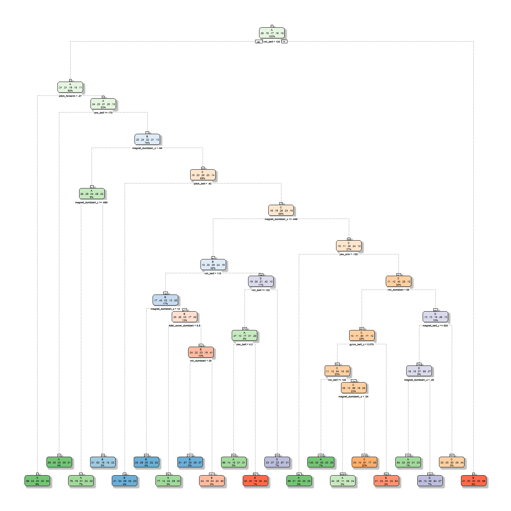

# Exercise Prediction
Biscuit7  
`r format(Sys.Date())`  


## Background

Using devices such as Jawbone Up, Nike FuelBand, and Fitbit it is now possible to collect a large amount of data about personal activity relatively inexpensively. These type of devices are part of the quantified self movement - a group of enthusiasts who take measurements about themselves regularly to improve their health, to find patterns in their behavior, or because they are tech geeks. One thing that people regularly do is quantify how much of a particular activity they do, but they rarely quantify how well they do it. In this project, your goal will be to use data from accelerometers on the belt, forearm, arm, and dumbell of 6 participants. They were asked to perform barbell lifts correctly and incorrectly in 5 different ways. More information is available from the website here: http://web.archive.org/web/20161224072740/http:/groupware.les.inf.puc-rio.br/har (see the section on the Weight Lifting Exercise Dataset).

## Objective

The goal is to predict the manner in which they did the exercise. This is the "classe" variable in the training set. 

## Data 

The training data are available here:
https://d396qusza40orc.cloudfront.net/predmachlearn/pml-training.csv

The test data are available here:
https://d396qusza40orc.cloudfront.net/predmachlearn/pml-testing.csv


## Required packages


```r
library(caret)
library(rpart)
library(rattle)
library(randomForest)
```


## Loading and cleaning the data

The following reads in the `training` and `testing` data, removes columns with missing values and those which have no prediction value.


```r
trainDF <- read.csv("pml-training.csv", na.strings = c("", "NA", 
    "#DIV/0!"), header = T, sep = ",")
trainRM <- trainDF[, colSums(is.na(trainDF)) == 0]
trainClean <- trainRM[, !grepl("^X|timestamp|window", names(trainRM))]
train <- trainClean[, sapply(trainClean, is.numeric)]
train$classe <- trainRM$classe

testDF <- read.csv("pml-testing.csv", na.strings = c("", "NA", 
    "#DIV/0!"), header = T, sep = ",")
testRM <- testDF[, colSums(is.na(testDF)) == 0]
testClean <- testRM[, !grepl("^X|timestamp|window", names(testRM))]
test <- testClean[, sapply(testClean, is.numeric)]
```

## Partitioning the data

We must partition the data into `training` and `validation` set at a 60:40 ratio. Set the seed for reproducibility purposes.


```r
set.seed(6789)
part <- createDataPartition(train$classe, p = 0.6, list = F)
trainPart <- train[part, ]
validPart <- train[-part, ]
```

## Classification tree


```r
decisionTree <- rpart(classe ~ ., data = trainPart, method = "class")
fancyRpartPlot(decisionTree, sub = "")
```



## Training the prediction model

The `random forest` technique will be used for prediction.


```r
model <- randomForest(classe ~ ., data = trainPart)
pred_valid <- predict(model, validPart, type = "class")
(CM <- confusionMatrix(pred_valid, validPart$classe))
```

```
## Confusion Matrix and Statistics
## 
##           Reference
## Prediction    A    B    C    D    E
##          A 2229    5    0    0    0
##          B    2 1509    9    0    0
##          C    0    4 1358   13    4
##          D    1    0    1 1273    3
##          E    0    0    0    0 1435
## 
## Overall Statistics
##                                           
##                Accuracy : 0.9946          
##                  95% CI : (0.9928, 0.9961)
##     No Information Rate : 0.2845          
##     P-Value [Acc > NIR] : < 2.2e-16       
##                                           
##                   Kappa : 0.9932          
##  Mcnemar's Test P-Value : NA              
## 
## Statistics by Class:
## 
##                      Class: A Class: B Class: C Class: D Class: E
## Sensitivity            0.9987   0.9941   0.9927   0.9899   0.9951
## Specificity            0.9991   0.9983   0.9968   0.9992   1.0000
## Pos Pred Value         0.9978   0.9928   0.9848   0.9961   1.0000
## Neg Pred Value         0.9995   0.9986   0.9985   0.9980   0.9989
## Prevalence             0.2845   0.1935   0.1744   0.1639   0.1838
## Detection Rate         0.2841   0.1923   0.1731   0.1622   0.1829
## Detection Prevalence   0.2847   0.1937   0.1758   0.1629   0.1829
## Balanced Accuracy      0.9989   0.9962   0.9947   0.9946   0.9976
```

### Accuracy

The `accuracy` of this method is given by:


```r
CM$overall["Accuracy"]
```

```
## Accuracy 
## 0.994647
```


The `out-of-sample error` is therefore given by: $0.005353$.

## Predicting values with test dataset

The predicted values of `classe`.


```r
predict(model, test, type = "class")
```

```
##  1  2  3  4  5  6  7  8  9 10 11 12 13 14 15 16 17 18 19 20 
##  B  A  B  A  A  E  D  B  A  A  B  C  B  A  E  E  A  B  B  B 
## Levels: A B C D E
```


